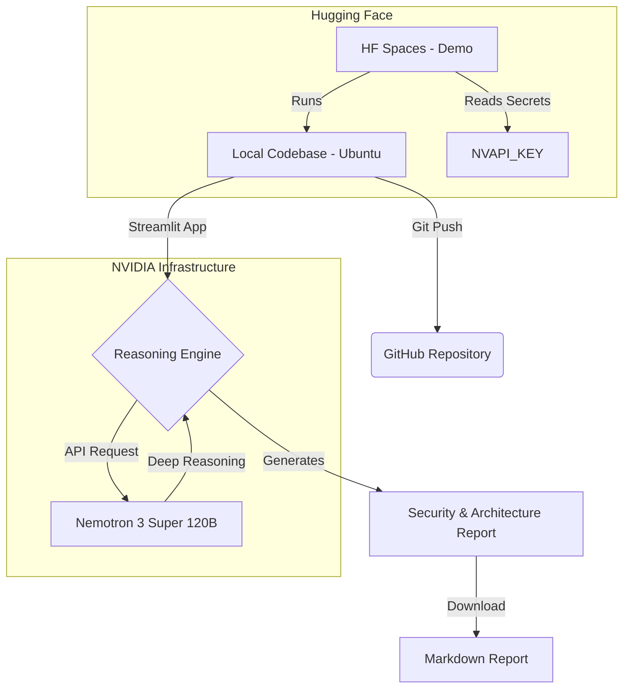

# 🛡️ Sovereign Code Auditor: Powered by Nemotron 3 Super

This project is a **Cybersecurity & Architecture Audit Agent** designed to analyze entire codebases privately and sovereignly. It leverages the frontier model **NVIDIA Nemotron 3 Super (120B)** to perform deep reasoning across massive contexts (up to 1M tokens).

---

## 📐 System Workflow & Architecture

The following diagram illustrates the integration between the local development environment, the version control system, the AI reasoning engine, and the final deployment.

🚀 Key Features
Frontier Reasoning: Multi-step vulnerability analysis (Chain-of-Thought) applied to complex business logic.

Massive Context (1M Tokens): Capacity to "read" and understand cross-file relationships within hundreds of files simultaneously.

Sovereign AI: Designed to run on private infrastructure (NVIDIA NIM), eliminating dependency on closed-source APIs and protecting intellectual property.

Automated Reporting: Generates detailed Markdown reports including risk severity levels and mitigation roadmaps.

🛠️ Tech Stack
Model: NVIDIA Nemotron 3 Super (120B) - FP8 Inference.

Orchestration: Python 3.11+ & OpenAI SDK (NVIDIA NIM compatible).

Interface: Streamlit (Interactive Dashboard).

Infrastructure: NVIDIA Build API / Hugging Face Spaces.

💻 Installation & Usage
Clone the repository:

Bash
git clone [https://github.com/oscartm/sovereign-code-auditor.git](https://github.com/oscartm/sovereign-code-auditor.git)
cd sovereign-code-auditor
Install dependencies:

Bash
pip install -r requirements.txt
Configure API Key:
Obtain your free NVAPI_KEY at build.nvidia.com.

Run the application:

Bash
streamlit run app.py
📋 Audit Example
Input: Python/Flask microservices repository.
Reasoning: Nemotron detected that an environment variable in config.py was being called without validation in db_connector.py, creating a potential injection risk.
Output: Detailed report with the suggested code patch and architectural fix.

📄 License
This project is licensed under the MIT License. The Nemotron 3 Super model is subject to NVIDIA’s applicable license terms.
